# vibescreen

A touch UI for Klipper printers.

This is a maintained fork of [guppyscreen](https://github.com/ballaswag/guppyscreen),
which stopped receiving commits in July 2024.

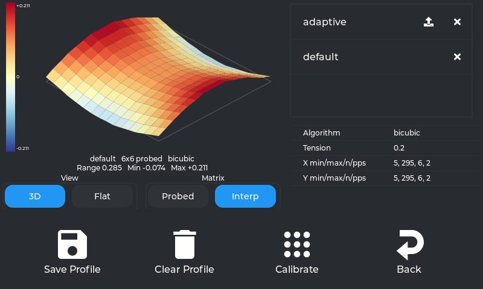

## What has changed since guppyscreen?

**The bed mesh panel was rewritten.** The 3D view labels the corners of its
ground plane with the bed's own coordinates, so the mesh can still be matched to
the machine after dragging it round.

| Flat heatmap | The probed points |
| --- | --- |
| 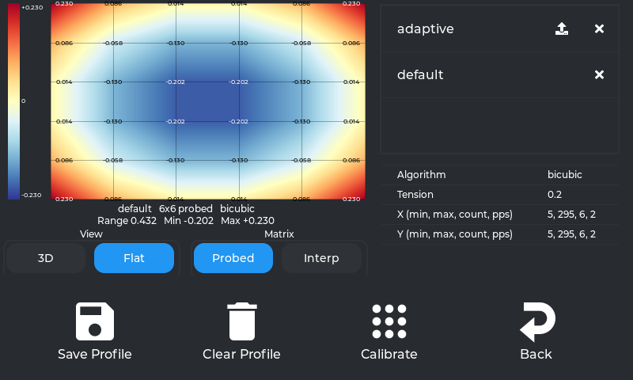 | 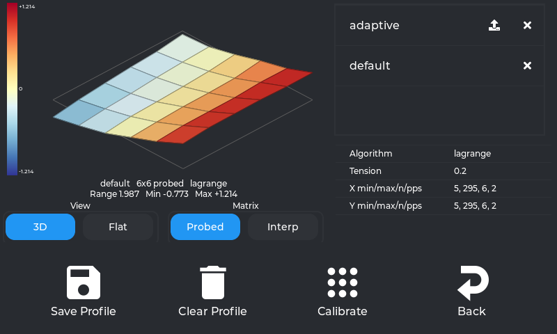 |

**The extruder panel was rewritten.** Its option lists are configurable, and
clamped to the printer's own limits read from Klipper.

**A refused command is no longer silent.**

**Update Guppy shows what it is doing.** It used to run the updater on the UI
thread, so the screen froze for the length of the download and then said
nothing either way. The update now runs in the background and its output
appears as it arrives, ending on Update finished or Update failed.

| Extruder options | A rejected command |
| --- | --- |
| 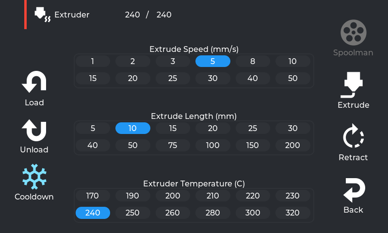 | 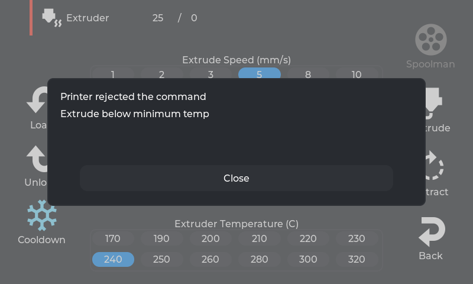 |

**Bed mesh Calibrate wipes the nozzle first.** When the printer has a
`WIPE_NOZZLE` macro, Calibrate runs it before probing. On a K1, K1C, K1SE or
K1 Max that macro comes from
[ProWiper](https://www.printables.com/model/1023575-prowiper-for-creality-k1-series),
formerly Advanced Nozzle Wiper.

**Bed mesh Calibrate homes only when something is unhomed.**

**The input shaper panel was rebuilt.**

| Input shaper with graphs | Input shaper with numbers |
| --- | --- |
| 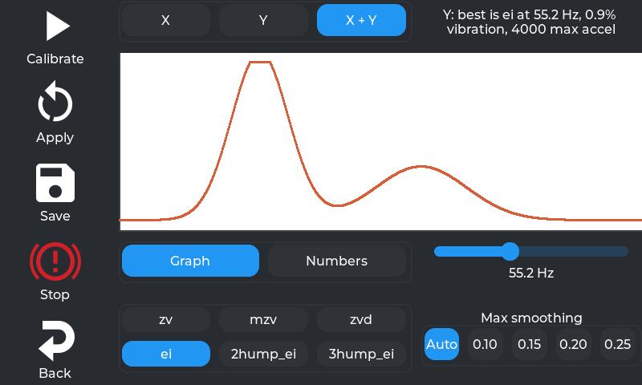 | 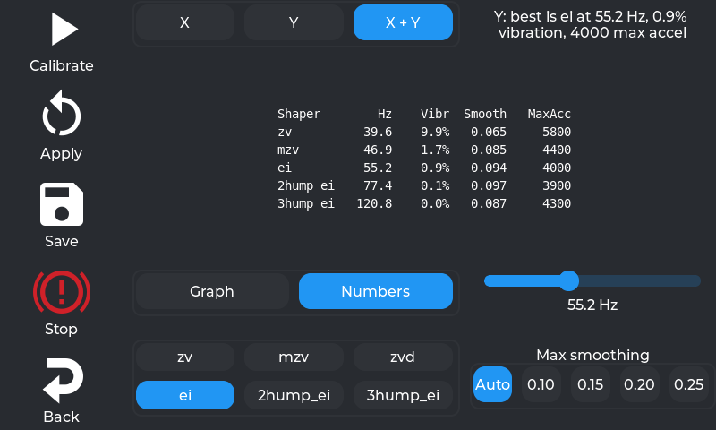 |

Those two come from `tools/fake_moonraker.py`, so the curve and the figures are
synthetic. A real run means shaking the printer for minutes per axis.

**Fan sliders know where the fan actually starts turning.** A Creality fan
does not move below a minimum duty cycle, and the slider used to write raw
values straight through, so on a K1 Max the Side Fan did nothing at all below
71 percent. The slider now maps its 0 to 100 the way the printer's own `M106`
does, in both directions, so a fan set to 50 percent reads back as 50 percent.

**The print status screen dismisses itself.** It used to stay up after a print
finished, stuck at 99 percent because the progress was truncated rather than
rounded.

**The file list refreshes when a file is uploaded**, rather than waiting for
someone to press Reload.

**Belt calibration reports its failures.** It ran both sweeps back to back and
recognised only success, so anything else left a spinner turning forever. It
now runs one sweep at a time, which is also what stops it exhausting memory on
a 209 MB machine, and says what went wrong.

**Wifi is usable.** A wrong password can be corrected instead of leaving the
screen saying Connecting forever, a saved network can be forgotten, and the
four punctuation characters missing from the keyboard are back, all of which
are legal in a WPA passphrase.

**Spoolman can be turned off**, and when it fails it says so instead of
disappearing.

**The Moonraker API key is sent** where one is configured, so a secured
Moonraker no longer refuses the connection in silence.

**Smaller things.** A third temperature on the print status screen for a
chamber sensor; pause asks for confirmation; a Z offset of 5.5e-17 renders as
0.000 mm rather than in scientific notation; three digit temperatures stop
wrapping onto two lines; the display sleep Never setting really is never; and
Z+ carries the arrow that matches what Z+ does.

**Underneath: lots of bug fixes and exception handlers.**

The rest of the interface:

| Move | Tuning |
| --- | --- |
| 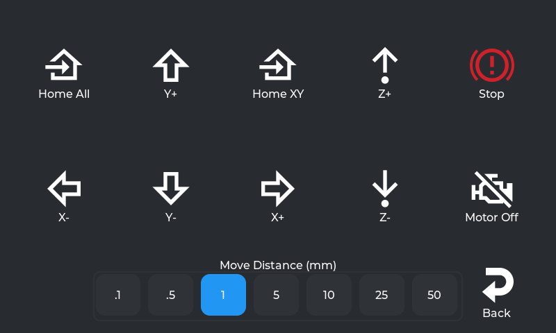 | 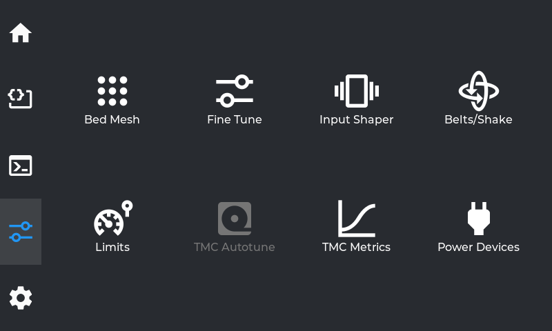 |

| Files | WiFi |
| --- | --- |
| 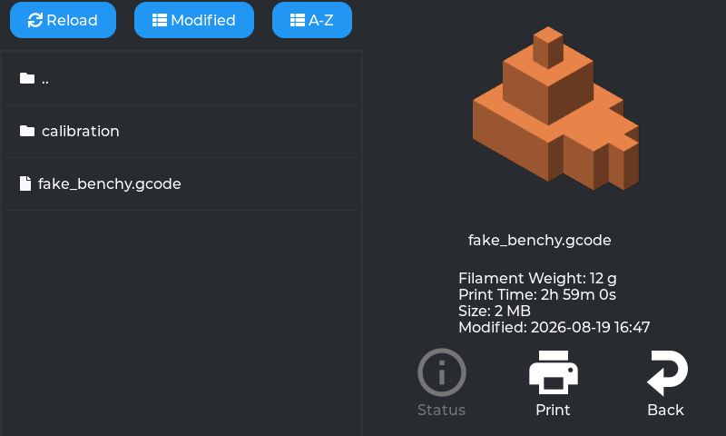 | 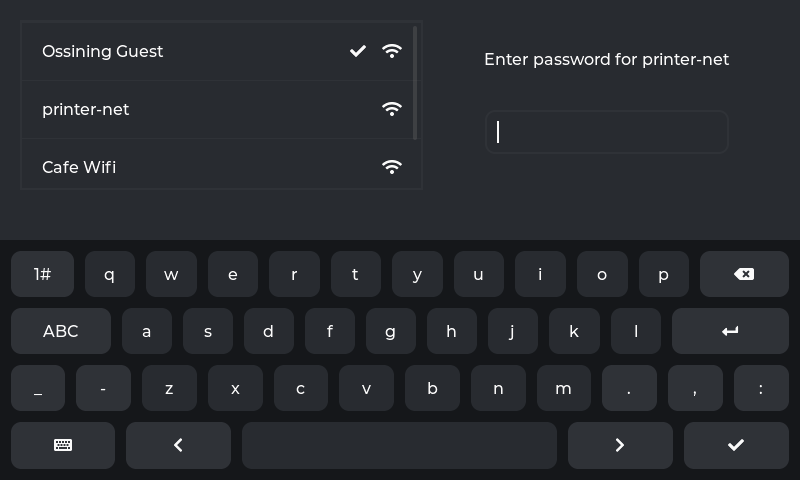 |

| Fine tune | Limits |
| --- | --- |
| 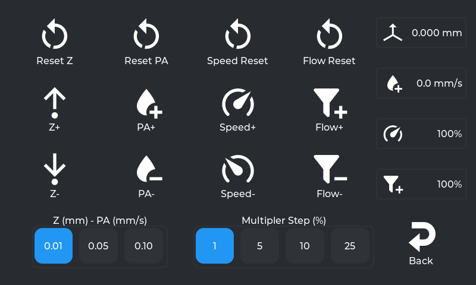 | 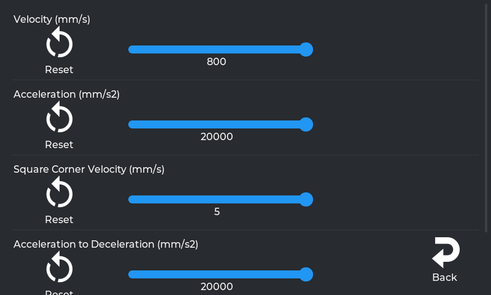 |

| Macros | Console |
| --- | --- |
| 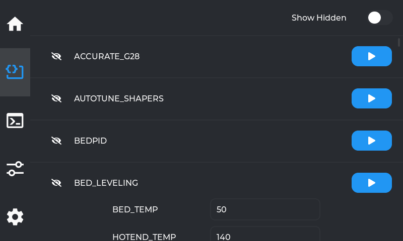 | 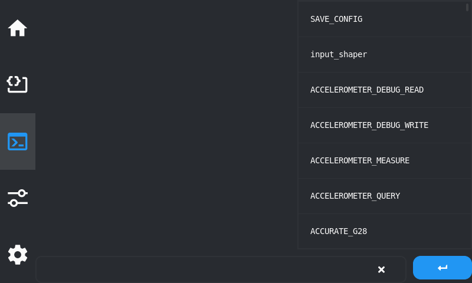 |

| Temperature | Fans |
| --- | --- |
| 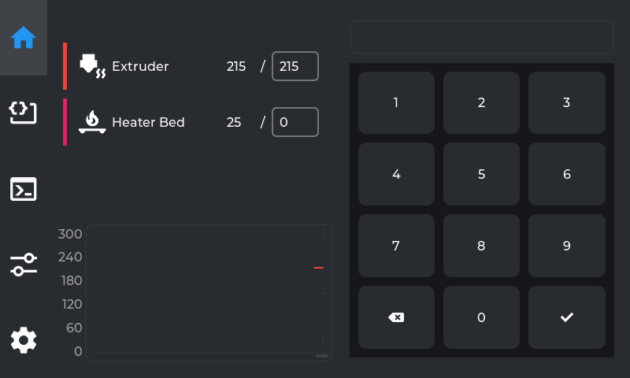 | 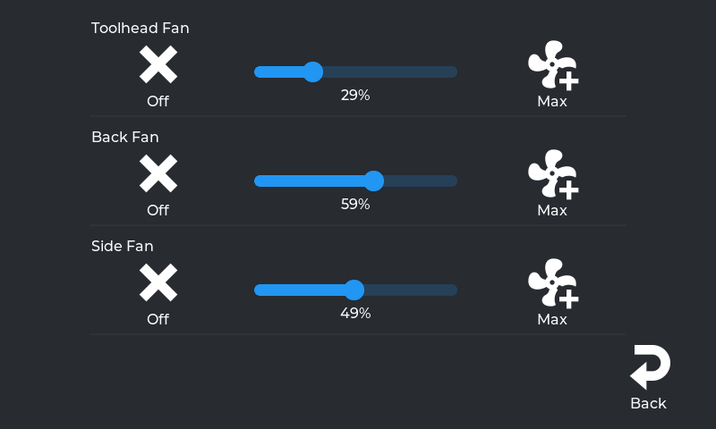 |

| LED | Settings |
| --- | --- |
| 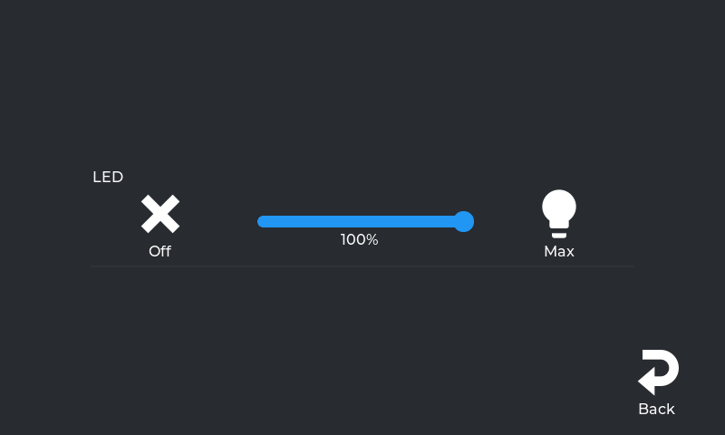 | 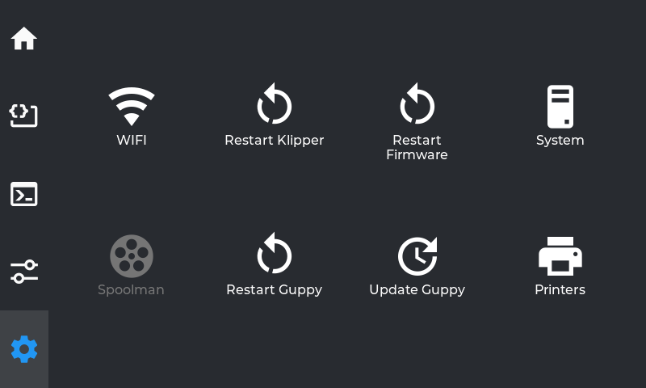 |

## Scope

Built and tested on my **Creality K1 Max**. That is the machine anything is verified against.

We also build for:

- `guppyscreen-smallscreen.tar.gz` for the Ender 3 V3 KE and Nebula Pad
- `guppyscreen-arm.tar.gz` for aarch64 boards such as a Pi or BTT Pad

Whether they run is unknown. Treat them as a starting point rather than a
supported target.

Android is not supported. Upstream shipped an APK built from a separate branch
and that has been removed.

## Installing

SSH into the printer and run:

```sh
sh -c "$(wget --no-check-certificate -qO - https://raw.githubusercontent.com/JuggyMcNutty/vibescreen/main/installer.sh)"
```

Add `-s zbolt` for the Z-Bolt icon set instead of Material Design.

The installer replaces Creality's display server, so the stock UI will be gone
afterwards. It backs up what it displaces to `/usr/data/guppyify-backup` and
offers to disable the rest of Creality's services while it is there.

This installs as `guppyscreen`, in `/usr/data/guppyscreen`, using the same
service name and config file as upstream. It is a drop-in replacement: an
existing guppyscreen install can be moved across without touching anything
else.

### Raspberry Pi and Debian

```sh
wget -O - https://raw.githubusercontent.com/JuggyMcNutty/vibescreen/main/installer-deb.sh | bash
```

Untested here. Have a way back to your current setup before running it.

## Updating

From the printer:

```sh
/usr/data/guppyscreen/update.sh
```

or press Update Guppy in the settings panel.

Releases are rolling and there is no separate stable track. Every push to
`main` that changes something other than documentation publishes its own
release, tagged by date and commit, so the
[release list](https://github.com/JuggyMcNutty/vibescreen/releases) doubles as a
build history. The updater always takes the newest.

Updating also refreshes the Klipper macros this project ships, which live in
the printer's own config tree rather than in the tarball. When any of them
change the updater says so and asks for a `FIRMWARE_RESTART`, which it will not
do for you, because that ends a print in progress. Run it when the printer is
idle. Whatever it replaced is kept alongside as a `.bak`.

Coming from the original guppyscreen, run the installer above instead. That
project's updater points at its own releases and will not see these.

## Uninstalling

```sh
/usr/data/guppyscreen/reinstall-creality.sh
```

That restores the Creality services and display server from the backup the
installer made.

## Building

`scripts/setup-toolchain.sh` once, then `scripts/build.sh mips` for the printer
or `scripts/build.sh sim` for an SDL build that runs on your desktop against a
real or fake Moonraker.

[DEVELOPMENT.md](DEVELOPMENT.md) covers the toolchain and the build targets.
[AGENTS.md](AGENTS.md) is the working reference for anyone changing the code,
including the hardware details in [docs/k1max-facts.md](docs/k1max-facts.md)
and the known defects in [docs/audit.md](docs/audit.md).

## Credits

guppyscreen was written by [ballaswag](https://github.com/ballaswag). This fork
exists because that work was worth keeping, and all original code belongs to
them.

Everything it talks to and borrows from:

- [Klipper](https://github.com/Klipper3d/klipper), the firmware all this is built around
- [Moonraker](https://github.com/Arksine/moonraker), the API it speaks to
- [KlipperScreen](https://github.com/KlipperScreen/KlipperScreen), prior art
  that shaped what a Klipper touch UI should do
- [Fluidd](https://github.com/fluidd-core/fluidd), for interface ideas and the
  print status calculations
- [Klippain-shaketune](https://github.com/Frix-x/klippain-shaketune), behind the
  belt calibration graphs
- [Material Design Icons](https://pictogrammers.com/library/mdi/) and
  [Z-Bolt](https://github.com/Z-Bolt/OctoScreen) for the two icon sets

Built on [LVGL](https://github.com/lvgl/lvgl),
[libhv](https://github.com/ithewei/libhv),
[spdlog](https://github.com/gabime/spdlog) and
[wpa_supplicant](https://w1.fi/wpa_supplicant/).

GPL-3.0, same as upstream.
